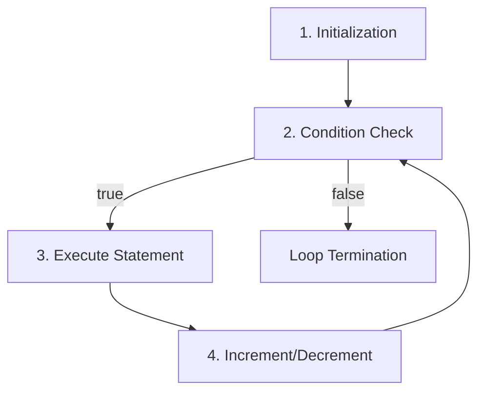

# Control Statements, Looping in Java (2025/06/26)

## Conditional Statements

### 1. if Statement

The `if` statement executes code based on a boolean condition.

#### Basic Syntax
```java
if(condition){
    statement to execute;
}
```

#### Multiple Independent if Statements
```java
// Each condition is checked independently
if(condition1){
    statement1;
}
if(condition2){
    statement2;
}
if(condition3){
    statement3;
}
```

#### if-else if-else Chain
```java
if(condition1){
    statement1;
}
else if(condition2){  // Only checked if above condition is false
    statement2;
}
else if(condition3){
    statement3;
}
else {
    statement4;   // Executed when all conditions are false
}
```

### 2. switch Statement

The `switch` statement provides multiple selection based on a single variable's value.

#### Syntax
```java
switch(value){
    case value1:
        statement;
        break;
    case value2:
        statement;
        break;
    case value3:
        statement;
        break;
    default:
        statement;
        break;
}
```

#### Important Notes
- **Fall-through behavior**: Without `break`, execution continues to the next case
- Use `break` to prevent unintended execution of subsequent cases
- `default` case acts like `else` in if-statements

---

## Control Flow Statements

### break Statement
- **Purpose**: Immediately exits the current block scope
- **Behavior**: In if-statements, exits the enclosing block, not just the if-statement

### continue Statement
- **Purpose**: Skips to the next iteration in loops
- **Use case**: When you want to skip remaining code in current iteration

---

## Conditional Statement Comparison

| Statement Type | Best Use Case | Example |
|---|---|---|
| **Ternary Operator** | Single condition with simple true/false outcomes | `result = (x > 0) ? "positive" : "negative"` |
| **if Statement** | Complex conditions with comparison operators (>, <, >=, <=) or logical operators (&&, \|\|) | `if(score >= 90 && attendance > 80)` |
| **switch Statement** | One variable with multiple possible values for equality comparison | `switch(dayOfWeek) { case 1: ... }` |

---

## Loop Statements

### Assignment Operators (Compound Assignment Operators)

#### Basic Assignment Operations
```java
int money = 10000;
// money = money - 1000;  // Basic form
money -= 1000;            // Compound assignment operator

int data = 0;
// data = data + 1;       // Basic form
// data += 1;             // Compound assignment operator
data++;                   // Increment operator
```

### Increment/Decrement Operators

| Operator Type | Syntax | When Applied |
|---|---|---|
| **Prefix** | `++data`, `--data` | Applied immediately on the current line |
| **Postfix** | `data++`, `data--` | Applied from the next line |

#### Example of Prefix vs Postfix
```java
int data = 10;

// Prefix: increment then print
System.out.println(++data);  // Output: 11

// Postfix: print then increment
System.out.println(data++);  // Output: 10
System.out.println(data);    // Output: 11
```

### 1. for Loop

#### Syntax
```java
for(initialization; condition; increment/decrement){
    statement to execute;
}
```

#### Execution Flow


#### Execution Order
1. **Initialization** (executed only once)
2. **Condition Check**
3. **Execute Statement** (if condition is true)
4. **Increment/Decrement**
5. **Condition Check** (return to step 2)
6. Repeat until condition becomes false

### 2. while Loop

#### Syntax
```java
while(condition){
    statement to execute;
}
```

### 3. do-while Loop

#### Syntax
```java
do {
    statement to execute;
} while(condition);
```

### Loop Selection Guidelines

| Loop Type | When to Use | Example Scenario |
|---|---|---|
| **for** | When you know the number of iterations | Print numbers from 1 to 100 |
| **while** | When you don't know the number of iterations | Until user chooses to exit |
| **do-while** | When you need to execute at least once | Menu system |

---

## Code Examples

### Example 1: ForTask - Basic Loop Operations

```java
package controlStatement;

public class ForTask {
    public static void main(String[] args) {
        
        // Print even numbers from 1 to 100
        for(int i = 1; i <= 100; i++) {			
            if (i % 2 == 0) {
                System.out.println(i);
            }
        }
        
        // Sum numbers from 1 to 10
        int result = 0;
        for(int i = 1; i <= 10; i++) {
            result += i;  // Compound assignment operator
        }
        System.out.println(result);  // Output: 55
    }
}
```

### Example 2: User Input with Loops

```java
package controlStatement;
import java.util.Scanner;

public class ForTask2 {
    public static void main(String[] args) {
        Scanner sc = new Scanner(System.in);
        
        // Sum of even numbers from 1 to 100
        int result1 = 0;
        for(int i = 1; i <= 100; i++) {
            if (i % 2 == 0) {
                result1 += i;
            }
        }
        System.out.println("Sum of even numbers 1-100: " + result1);
        
        // Get user input and sum from 1 to n
        System.out.println("Enter N: ");
        int userInput = sc.nextInt();
        int result2 = 0;
        for(int i = 1; i <= userInput; i++) {
            result2 += i;
        }
        System.out.println("Sum from 1 to " + userInput + ": " + result2);
        
        sc.close();
    }
}
```

### Example 3: String Comparison in if Statement

```java
package controlStatement;
import java.util.Scanner;

public class IfTest {
    public static void main(String[] args) {
        Scanner sc = new Scanner(System.in);
        String message = "What did you eat for dinner today?";
        String food = null;
        
        System.out.println(message);
        food = sc.next();
        
        // Use .equals() for string comparison
        if(food.equals("chicken")) {
            System.out.println("You overate.");
        } else if(food.equals("salad")) {
            System.out.println("You're on a diet.");
        } else if(food.equals("alcohol")) {
            System.out.println("You were drinking heavily.");
        } else {
            System.out.println("You went hungry.");
        }
        
        sc.close();
    }
}
```

### Example 4: Animal Sound Menu System

```java
package controlStatement;
import java.util.Scanner;

public class IfTask {
    public static void main(String[] args) {
        
        int dog = 1, cat = 2, chicken = 3, fox = 4;
        String message = "Select an animal sound button:\n"
                + "1. Dog\n"
                + "2. Cat\n"
                + "3. Chicken\n"
                + "4. Fox\n"
                + "Enter your choice:";
        int userInput = 0;
        Scanner sc = new Scanner(System.in);
        
        System.out.println(message);
        userInput = sc.nextInt();
        
        if (userInput == dog) {
            System.out.println("Woof woof");
        }
        else if (userInput == cat) {
            System.out.println("Meow");
        }
        else if (userInput == chicken) {
            System.out.println("Cluck cluck");
        }
        else if (userInput == fox) {
            System.out.println("What does the fox say?");
        }
        else {
            System.out.println("Invalid input.");
        }
        
        sc.close();
    }
}
```

### Example 5: Switch Statement with Fall-through

```java
package controlStatement;
import java.util.Scanner;

public class SwitchTest {
    public static void main(String[] args) {
        Scanner sc = new Scanner(System.in);
        int choice = 0;
        String message = "Select an animal sound button:\n"
                + "1. Dog\n"
                + "2. Cat\n"
                + "3. Chicken\n"
                + "4. Fox";
        
        System.out.println(message);
        choice = sc.nextInt();
        
        // Switch is not a multi-selection statement. Without break,
        // it executes all subsequent cases (fall-through behavior)
        switch(choice) {
            case 1:
                System.out.println("Growl");
                break;
            case 2:
                System.out.println("Meow");
                break;
            case 3:
                System.out.println("Cluck cluck");
                break;
            case 4:
                System.out.println("Ring-ding-ding");
                break;
            default:  // Equivalent to else
                System.out.println("Wrong selection.");
                break;
        }
        
        sc.close();
    }
}
```

### Example 6: While Loop Applications

```java
package controlStatement;
import java.util.Scanner;

public class WhileTest {
    public static void main(String[] args) {
        
        // Basic while loop
        int count = 0;
        while(true) {
            System.out.println("Current count: " + count);
            count++;
            if (count == 100000) {
                break;  // Exit the loop
            }
        }
        
        // do-while loop - Customer service system
        String message = "1. Report lost device\n"
                    + "2. Change carrier\n"
                    + "3. Change payment method\n"
                    + "5. End consultation\n"
                    + "0. Connect to representative";
        Scanner sc = new Scanner(System.in);
        int choice = 0;
        
        // Continue until user presses 5
        do {
            System.out.println(message);
            choice = sc.nextInt();
        } while(choice != 5);
        
        sc.close();
    }
}
```

### Example 7: Character Operations with Loops

```java
package controlStatement;

public class ForTest {
    public static void main(String[] args) {

        // Difference between prefix and postfix
        int data = 10;
        
        // Increment data and then print
        System.out.println(++data);  // Output: 11

        // Print data and then increment		
        System.out.println(data++);  // Output: 11
        System.out.println(data);    // Output: 12
        
        // for loop example
        for(int i = 0; i < 10; i++) {
            System.out.println((i + 1) + ". John Doe");
        }
        
        // Print 10 to 1
        for(int i = 10; i > 0; i--) {
            System.out.println(i);
        }
        
        // Alternative way to print 10 to 1		
        for(int i = 0; i < 10; i++) {
            System.out.println(10 - i);
        }
    }
}
```

---

## Practice Problems

### Basic Problems (Pass Level)

1. **Print numbers from 1 to 100**
2. **Print numbers from 100 to 1**
3. **Print odd numbers from 100 to 1**
4. **Calculate sum of numbers from 1 to 50**
5. **Print numbers from 10 to 20 (within 1-100 range)**

### Advanced Problems (Surf Level)

1. **Print letters A to F**
2. **Print letters A to F excluding C**
3. **Print aBcDeFgHi...Z (alternating case)**

### Master Problem

**Star Pattern**
```
    *
   ***
  *****
 *******
*********
```

### Solution Examples

```java
package controlStatement;

public class ForTask3 {
    public static void main(String[] args) {
        
        // 1. Print numbers from 1 to 100
        System.out.println("1. Print numbers from 1 to 100");
        for (int i = 1; i <= 100; i++) {
            System.out.println(i);
        }
        
        // 2. Print numbers from 100 to 1
        System.out.println("2. Print numbers from 100 to 1");
        for (int i = 100; i >= 1; i--) {
            System.out.println(i);
        }
        
        // 3. Print odd numbers from 100 to 1
        System.out.println("3. Print odd numbers from 100 to 1");
        for (int i = 100; i >= 1; i--) {
            if (i % 2 != 0) {
                System.out.println(i);
            }
        }
        
        // 4. Sum all values from 1 to 50
        int result = 0;
        System.out.println("4. Sum all values from 1 to 50");
        for (int i = 1; i <= 50; i++) {
            result += i;
        }
        System.out.println("Sum: " + result);
        
        // 5. Print numbers from 10 to 20 (within 1-100 range)
        System.out.println("5. Print numbers from 10 to 20");
        for (int i = 1; i <= 100; i++) {
            if (10 <= i && i <= 20) {
                System.out.println(i);
            }
        }
        
        // Advanced Problems
        
        // Print A to F
        System.out.println("Print A to F:");
        for(int i = 0; i < 6; i++) {
            System.out.print((char)('A' + i));
        }
        System.out.println();
        
        // Print A to F excluding C
        System.out.println("Print A to F excluding C:");
        for(int i = 0; i < 6; i++) {
            if (i == 2) {  // C is at index 2 from A
                continue;
            }
            System.out.println((char)('A' + i));
        }
        
        // Print aBcDeFgHi...Z (alternating case)
        System.out.println("Print aBcDeFgHi...Z:");
        for(int i = 0; i < 26; i++) {
            if (i % 2 == 0) {
                System.out.print((char)('a' + i));  // lowercase
            } else {
                System.out.print((char)('A' + i));  // uppercase
            }
        }
        System.out.println();
    }
}
```

---

## Incomplete Code Example (MBTI Analysis)

The original notes included an incomplete MBTI analysis program. Here's the corrected version:

```java
package controlStatement;
import java.util.Scanner;

public class WhileTask {
    public static void main(String[] args) {
        // MBTI Analysis Program
        // User inputs their MBTI and receives a message
        // Using while loop
        
        String mbti = null;
        Scanner sc = new Scanner(System.in);
        
        System.out.println("Enter your MBTI type (or 'exit' to quit):");
        
        while(true) {
            mbti = sc.next().toUpperCase();
            
            if(mbti.equals("EXIT")) {
                System.out.println("Goodbye!");
                break;
            }
            
            switch(mbti) {
                case "ESFP":
                    System.out.println("You are sociable and create a fun atmosphere that makes people happy.");
                    break;
                case "INTP":
                    System.out.println("You are logical and creative, open to new ideas.");
                    break;
                case "ISTP":
                    System.out.println("You have excellent problem-solving skills with flexible and practical thinking.");
                    break;
                case "INFJ":
                    System.out.println("You have insightful and deep thinking, understanding people's hearts well.");
                    break;
                case "ISTJ":
                    System.out.println("You are responsible and reliable, a solid pillar of any organization.");
                    break;
                case "ISFJ":
                    System.out.println("You are deeply caring and devoted, warmly taking care of those around you.");
                    break;
                case "INTJ":
                    System.out.println("You achieve goals effectively with systematic and strategic thinking.");
                    break;
                case "ISFP":
                    System.out.println("You are quiet and emotional with excellent artistic sense.");
                    break;
                case "INFP":
                    System.out.println("You pursue ideals and genuinely empathize with others' emotions.");
                    break;
                case "ESTP":
                    System.out.println("You are energetic with excellent situational coping skills and strong action-oriented behavior.");
                    break;
                case "ENFP":
                    System.out.println("You are passionate and creative, enjoying interactions with people.");
                    break;
                case "ENTP":
                    System.out.println("You are witty and challenging, trying new things with enthusiasm.");
                    break;
                case "ESTJ":
                    System.out.println("You are systematic and realistic, leading organizations well.");
                    break;
                case "ESFJ":
                    System.out.println("You take good care of people, value harmony, and provide trust.");
                    break;
                case "ENFJ":
                    System.out.println("You have excellent leadership and outstanding ability to motivate others.");
                    break;
                case "ENTJ":
                    System.out.println("You are decisive and strategically push toward goals.");
                    break;
                default:
                    System.out.println("Invalid MBTI type. Please enter a valid 4-letter MBTI type.");
                    break;
            }
            
            System.out.println("Enter another MBTI type (or 'exit' to quit):");
        }
        
        sc.close();
    }
}
```

---

## Key Concepts Summary

### Important Concepts

1. **String Comparison**: Use `.equals()` instead of `==` for strings
2. **Increment/Decrement Operators**: Understand the difference between prefix and postfix
3. **Switch Fall-through**: Importance of `break` statements
4. **Loop Selection**: Choose appropriate loop type for the situation
5. **ASCII Code Usage**: Type casting for character output

### Debugging Tips

- **Infinite Loop Prevention**: Always check exit conditions in while loops
- **Boundary Checking**: Verify array or string index access
- **Type Conversion**: Consider ASCII values when converting between char and int
- **Logic Errors**: Test edge cases and boundary conditions

### Best Practices

1. **Use meaningful variable names**
2. **Add comments for complex logic**
3. **Handle user input validation**
4. **Use appropriate data types**
5. **Follow consistent code formatting**
