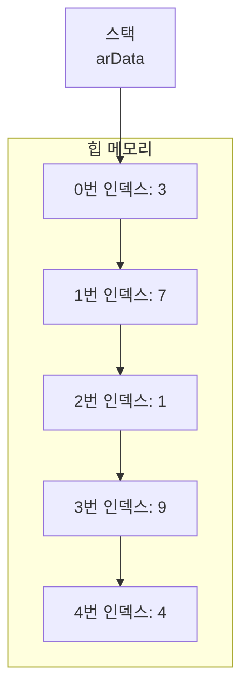

# Methods, Array in Java (2025/06/27)

## 📚 배열 (Arrays)

배열은 동일한 타입의 데이터 여러 개를 연속된 공간에 나열하여 관리하는 자료구조입니다.

### 배열을 사용하는 이유

1.  **효율적인 관리**: `int num1, num2, num3;` 처럼 여러 변수를 선언하는 대신, 하나의 배열 이름으로 여러 개의 저장 공간을 관리할 수 있어 편리합니다.
2.  **규칙성 부여**: 특별한 규칙이 없는 값들에 인덱스(순번)를 통해 규칙적인 순서를 부여할 수 있습니다.

### 배열 선언 방법

배열은 선언 시점에 알고 있는 정보에 따라 다양한 방법으로 선언할 수 있습니다.

| 선언 문법 | 사용하는 경우 |
| :--- | :--- |
| `자료형[] 배열명 = {값1, 값2, ...};` | 배열에 저장할 초기값을 모두 알고 있을 때 사용합니다. |
| `자료형[] 배열명 = new 자료형[칸수];` | 저장할 값은 모르지만, 몇 개의 공간이 필요한지는 알 때 사용합니다. |
| `자료형[] 배열명 = null;` | 값과 칸수 모두 모를 때 사용합니다. 나중에 반드시 초기화해야 합니다. |

  * **`new`**: **힙(Heap)** 메모리에 공간을 할당하는 키워드입니다. `new`로 기본 자료형 배열을 생성하면 각 요소는 자동으로 기본값(`int`는 `0`, `boolean`은 `false` 등)으로 초기화됩니다.
  * **`null`**: 참조형 변수의 초기값으로, "아무 주소도 가리키지 않고 있다"는 의미입니다.
  * **힙 메모리**: 자바에서 배열은 항상 객체이므로, 동적 메모리 영역인 힙에 할당됩니다. 따라서 메모리 관점에서는 모든 자바 배열이 동적 배열입니다.

### 배열의 구조

다음 배열을 예로 들어보겠습니다.
`int[] arData = {3, 7, 1, 9, 4};`

  * `arData`라는 변수(참조 변수)는 스택(Stack) 메모리에 생성됩니다.
  * 실제 데이터 `{3, 7, 1, 9, 4}`는 **힙(Heap)** 메모리의 연속된 공간에 저장됩니다.
  * `arData` 변수에는 힙에 생성된 데이터 묶음의 **첫 번째 공간의 주소값**이 저장됩니다.

<!-- end list -->



배열의 각 공간에 접근하기 위해 \*\*인덱스(index)\*\*를 사용합니다.

  * C/C++ 같은 언어에서는 `*(arData + 2)`와 같이 포인터 연산을 사용해 주소에 접근할 수 있습니다.
  * 자바는 포인터 직접 접근을 허용하지 않고, 대신 대괄호 `[]`를 사용합니다. `arData[2]`는 내부적으로 시작 주소로부터 2칸 떨어진 위치를 계산하여 해당 값을 가져옵니다.
  * **중요**: 배열의 인덱스는 항상 **0부터 시작**합니다.

### `length` 속성

자바의 모든 배열은 `length`라는 `final` 속성을 가집니다. 이 속성에는 배열의 총 길이(칸수)가 담겨 있습니다.

**문법**: `배열명.length`

### 배열 사용법

| 코드 | 요소의 종류 | 설명 |
| :--- | :--- | :--- |
| `int[] arData = new int[5];` | 저장 공간 | 5개의 정수를 담을 수 있는 빈 배열을 생성합니다. |
| `arData[0] = 10;` | 저장 공간 | 첫 번째 요소(0번 인덱스)에 값 `10`을 할당합니다. |
| `arData[0] + 9;` | 값 | 0번 인덱스의 값(`10`)을 읽어와 `9`를 더합니다. 결과는 `19`입니다. |
| `System.out.println(arData);` | 주소값 | 배열의 내용이 아닌, 힙 메모리상의 주소값을 출력합니다. |
| `arData[2] = arData[0] + arData[1];` | 저장 공간, 값, 값 | 0번과 1번 인덱스의 값을 더한 결과를 2번 인덱스에 저장합니다. |
| `System.out.println(arData[5]);` | **오류** | 유효 인덱스(0\~4)를 벗어났으므로 `ArrayIndexOutOfBoundsException`이 발생합니다. |

-----

### 배열 코드 예제

#### 📝 `ArrayP1.java`: 기본 초기화 및 반복문

```java
package arrayTest;

public class ArrayP1 {
    public static void main(String[] args) {
        // 배열 초기화 방법
        int[] arr = {1, 3, 2, 5, 7}; // 직접 초기화
        int[] arr2 = new int[5];     // 크기로 초기화 (기본값 0으로 채워짐)
        int[] arr3 = null;           // null로 초기화

        // System.out.println(arr2); // arr2의 메모리 주소 출력
        // System.out.println(arr2[0]); // 기본 초기화 값인 0 출력

        // 문제: arr에 5, 4, 3, 2, 1을 순서대로 담은 후 출력
        // 로직: 인덱스 4부터 0까지 역순으로 반복
        for(int i = 4; i >= 0; i--) {
            arr[i] = i + 1; // 값 할당
            System.out.println("arr[" + i + "] = " + arr[i]);
        }

        // 동일한 결과를 내는 다른 로직
        // for(int i = 0; i < 5; i++) {
        //	 arr[i] = 5 - i;
        // }

        // .length 속성을 사용한 반복
        System.out.println("배열의 길이: " + arr.length);
        for(int i = 0; i < arr.length; i++) {
            System.out.println(arr[i]);
        }
    }
}
```

#### 📝 `ArrayT1.java`: 배열 활용 문제

```java
package arrayTest;

import java.util.Scanner;

public class ArrayT1 {
    public static void main(String[] args) {
        // 1. 10칸짜리 배열에 1~10까지 담기
        int[] arr = new int[10];
        for (int i = 0; i < arr.length; i++) {
            arr[i] = i + 1;
        }

        // 2. 1~100까지 배열에 담고 홀수만 출력
        int[] arr1 = new int[100];
        for (int i = 0; i < arr1.length; i++) {
            arr1[i] = i + 1; // 숫자 저장
            if (arr1[i] % 2 != 0) { // 홀수인지 검사
                System.out.println(arr1[i]);
            }
        }

        // 3. 1~10까지 배열에 담고 모든 누적합 출력
        int[] arr2 = new int[10];
        int totalSum = 0;
        for (int i = 0; i < arr2.length; i++) {
            arr2[i] = i + 1;
            totalSum += arr2[i];
        }
        System.out.println("누적 합계: " + totalSum);

        // 4. 5개의 정수를 입력받고 최댓값과 최솟값 출력
        int[] arr3 = new int[5];
        Scanner sc = new Scanner(System.in);
        System.out.println("5개의 정수를 입력하세요 (예: 10 20 30 40 50):");

        for (int i = 0; i < arr3.length; i++) {
            arr3[i] = sc.nextInt();
        }

        int max = arr3[0]; // 첫 번째 요소를 최댓값으로 가정
        int min = arr3[0]; // 첫 번째 요소를 최솟값으로 가정

        // 두 번째 요소부터 비교 시작
        for (int i = 1; i < arr3.length; i++) {
            if (max < arr3[i]) {
                max = arr3[i]; // 새로운 최댓값 발견
            }
            if (min > arr3[i]) {
                min = arr3[i]; // 새로운 최솟값 발견
            }
        }

        System.out.println("최댓값: " + max);
        System.out.println("최솟값: " + min);
    }
}
```

#### 📝 `ArrayT2.java`: 문자 배열 활용 (대소문자 변환)

```java
package arrayTest;

import java.util.Scanner;

// 사용자가 입력한 문자열의 영문 대소문자를 바꿔서 출력하는 프로그램
public class ArrayT2 {
    public static void main(String[] args) {
        Scanner sc = new Scanner(System.in);
        String message = "대소문자를 바꿀 문장을 입력하세요:";
        System.out.println(message);
        String input = sc.nextLine();

        // 입력받은 문자열 길이만큼의 char 배열 생성
        char[] arr = new char[input.length()];

        // 아스키 코드 값: 'A'=65, 'a'=97. 차이는 32.
        for (int i = 0; i < input.length(); i++) {
            char c = input.charAt(i);

            if (c >= 'A' && c <= 'Z') { // 대문자인 경우
                arr[i] = (char)(c + 32); // 소문자로 변환
            } else if (c >= 'a' && c <= 'z') { // 소문자인 경우
                arr[i] = (char)(c - 32); // 대문자로 변환
            } else { // 영문자가 아닌 경우
                arr[i] = c; // 그대로 저장
            }
        }

        // 변환된 문자 배열을 출력
        for (int i = 0; i < arr.length; i++) {
            System.out.print(arr[i]);
        }
        System.out.println(); // 줄바꿈
    }
}
```

-----

## ⚙️ 메소드 (Methods)

**메소드**는 특정 기능을 수행하는 코드 블록으로, 필요할 때마다 호출하여 실행할 수 있습니다. 수학의 함수와 유사합니다.

`f(x) = 2x + 1`
여기서 `f`는 **메소드 이름**, `x`는 **매개변수**에 해당합니다.

### 메소드 선언

메소드의 선언 구조는 다음과 같습니다.

`(1)리턴타입 (2)메소드명((3)자료형 매개변수명, ...)` `{`
    `(4)실행할 문장;`
    `(5)return 리턴값;`
`}`

1.  **리턴 타입**: 메소드가 실행된 후 반환하는 값의 데이터 타입. 반환할 값이 없으면 `void`를 씁니다.
2.  **메소드명**: 메소드의 이름. 관례적으로 동사 형태(예: `add`, `printName`)로 짓습니다.
3.  **매개변수 (Parameters)**: 외부에서 메소드로 전달되는 값을 받는 변수입니다.
4.  **메소드 바디 (Body)**: 메소드의 실제 기능을 구현하는 코드를 작성하는 부분. 비어 있을 수도 있습니다.
5.  **`return` 문**: 호출한 곳으로 값을 반환합니다. 리턴 타입이 `void`가 아니면 반드시 필요합니다.

### 메소드 만들기 순서

두 정수의 덧셈 메소드를 만드는 과정입니다.

1.  **메소드 이름 생각하기**: `add`, `plus`, `sum` 등. `add`로 정하겠습니다.
      * `add()` 와 중괄호 `{}`를 붙여 기본 틀을 만듭니다: `add() {}`
2.  **매개변수 생각하기**: 정수 두 개가 필요합니다.
      * `add(int number1, int number2) {}`
3.  **실행할 문장 작성하기**: 두 매개변수를 더합니다.
      * `add(int number1, int number2) { int result = number1 + number2; }`
4.  **`return` 값 작성하기**: 계산 결과인 `result`를 반환합니다.
      * `add(int number1, int number2) { int result = number1 + number2; return result; }`
5.  **리턴 타입 결정하기**: `result`가 `int` 타입이므로 리턴 타입도 `int`입니다.
      * **최종 메소드**: `int add(int number1, int number2) { int result = number1 + number2; return result; }`

### 메소드 사용 시 주의사항

  * **선언**: 메소드를 **선언**할 때는 `{}`(중괄호)가 있으며, **반드시 다른 메소드 밖**에서 해야 합니다.
  * **사용(호출)**: 메소드를 **사용**할 때는 `{}`가 없으며, **반드시 다른 메소드 안**에서 해야 합니다.

### 메소드의 목적

1.  **재사용성**: 코드를 한 번만 작성하고 여러 곳에서 호출하여 사용합니다. 재사용성을 높이려면 특정 상황에만 의존하지 않는 범용적인 기능으로 만드는 것이 좋습니다.
2.  **코드 간결화**: 복잡한 코드를 기능 단위로 나누어 코드의 구조를 단순하고 이해하기 쉽게 만듭니다.

### `return`은 언제 사용하는가?

  * **`return`을 해야 할 때**: 메소드를 호출한 쪽에서 처리 결과가 필요할 때.
  * **`return`을 하면 안 될 때 (`void`)**: 단순히 특정 동작(예: 화면에 출력)만 수행하고, 호출한 쪽에 결과를 전달할 필요가 없을 때.

-----

### 메소드 코드 예제

#### 📝 `Mtest.java`: 기본 메소드 선언과 사용

```java
package methodTest;

// 원본 파일에 오타가 있는 것으로 보입니다. 'MethodTest mt = new MethodTest();'는
// 클래스 이름과 맞지 않으므로 'Mtest mt = new Mtest();'로 수정했습니다.

public class Mtest {
    // 메소드 선언
    // 이름을 전달받아 콘솔에 출력하는 메소드
    // 반환할 값이 없으므로 리턴 타입은 'void'
    void printTest(String name) {
        System.out.println("안녕하세요, " + name + "님");
    }

    // 두 정수를 전달받아 더한 결과를 반환하는 메소드
    // 리턴 타입은 'int'
    int sumTest(int num1, int num2) {
        return num1 + num2;
    }

    public static void main(String[] args) {
        // 메소드 사용
        // non-static 메소드를 호출하려면 먼저 클래스의 객체를 생성해야 합니다.
        Mtest mt = new Mtest();

        // printTest 메소드 호출. void 메소드이므로 값으로 받을 수 없습니다.
        mt.printTest("홍길동");

        // sumTest 메소드 호출. int 값을 반환합니다.
        // 반환된 값(50)을 변수 num에 저장합니다.
        int num = mt.sumTest(20, 30);
        System.out.println("두 수의 합: " + num);
    }
}
```

#### 📝 `Mtask1.java`: 실용적인 메소드 예제

```java
package methodTest;

import java.util.Scanner;

public class Mtask1 {

    // 1. 하나의 정수를 전달받으면 2배로 값을 반환해주는 메소드
    int multiply2(int num) {
        return num * 2;
    }

    // 2. 이름을 n번 출력하는 메소드
    // 화면에 출력만 하면 되므로 리턴 타입은 'void'
    void printName(String name, int n) {
        for (int i = 0; i < n; i++) {
            System.out.println((i + 1) + "번째: " + name);
        }
    }

    public static void main(String[] args) {
        Mtask1 mt = new Mtask1();

        // --- 1번 메소드 호출 ---
        int result = mt.multiply2(100);
        System.out.println("multiply2 결과: " + result);

        // --- 2번 메소드 호출 ---
        Scanner sc = new Scanner(System.in);
        String message = "이름과 반복할 횟수를 입력하세요 (예: 홍길동 3)";
        System.out.println(message);

        String name = sc.next(); // 이름 읽기
        int count = sc.nextInt(); // 횟수 읽기

        mt.printName(name, count);
    }
}
```