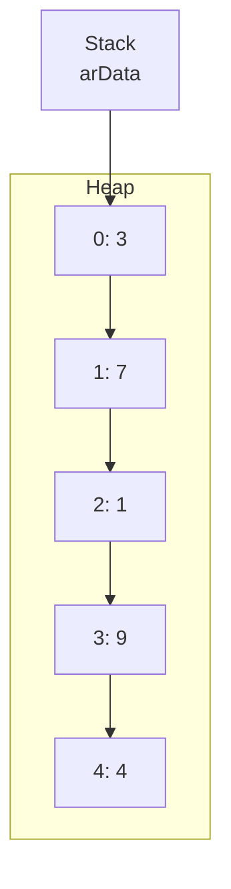

# Methods, Array in Java (2025/06/27)

## 📚 Arrays

An array is a collection of elements of the same type, stored in contiguous memory locations.

### Why Use Arrays?

1.  **Efficient Management**: Instead of declaring multiple variables with different names (e.g., `int num1, num2, num3;`), you can declare a single array with a single name to hold multiple values. This simplifies data management.
2.  **Imposing Order**: Arrays can give a structured order (through indices) to a set of values that might not have an intrinsic rule or pattern.

### Declaring Arrays

There are several ways to declare an array, depending on what you know at the time of declaration.

| Declaration Syntax | When to Use |
| :--- | :--- |
| `DataType[] arrayName = {value1, value2, ...};` | When you know the exact values to be stored initially. |
| `DataType[] arrayName = new DataType[size];` | When you know the number of elements but not their initial values. |
| `DataType[] arrayName = null;` | When you don't know the initial values or the size. You must initialize it later before use. |

  * **`new`**: This keyword allocates memory on the **Heap**. When you create an array of a primitive type with `new`, its elements are automatically initialized to a default value (e.g., `0` for `int`, `false` for `boolean`).
  * **`null`**: This is the default value for an object reference. It means the array variable doesn't point to any memory location yet.
  * **Heap Memory**: In Java, arrays are always objects, meaning they are stored in the heap (a region of memory for dynamic allocation). Technically, all Java arrays are "dynamic arrays" in terms of memory allocation.

### Array Structure

Let's consider this array:
`int[] arData = {3, 7, 1, 9, 4};`

  * The variable `arData` itself is a reference variable stored on the stack.
  * The actual array data (`3, 7, 1, 9, 4`) is stored in a contiguous block of memory on the **Heap**.
  * The `arData` variable holds the memory address of the *first* element in the heap.

<!-- end list -->



To access an element, Java uses an **index**. The index is an integer that represents the offset from the starting address.

  * In languages like C/C++, you might access the element `1` using pointer arithmetic like `*(arData + 2)`.
  * Java simplifies this with the square bracket `[]` notation. `arData[2]` internally calculates the address and retrieves the value.
  * **Important**: Array indices always start from **0**.

### `length` Property

Every array in Java has a `length` property, which is a `final` variable that stores the number of elements the array can hold.

**Syntax**: `arrayName.length`

### Using Arrays

| Code Snippet | Type of Element | Description |
| :--- | :--- | :--- |
| `int[] arData = new int[5];` | Storage Space | Creates an integer array with 5 empty slots. |
| `arData[0] = 10;` | Storage Space | Assigns the value `10` to the first element. |
| `arData[0] + 9;` | Value | Accesses the value at index `0` (`10`) and adds `9` to it. The result is `19`. |
| `System.out.println(arData);` | Address | Prints the memory address (reference) of the array, not its contents. |
| `arData[2] = arData[0] + arData[1];` | Storage, Value, Value | Assigns the sum of the first two elements to the third element. |
| `System.out.println(arData[5]);` | **Error** | Throws an `ArrayIndexOutOfBoundsException` because the valid indices are 0 to 4. |

-----

### Array Code Examples

#### 📝 `ArrayP1.java`: Basic Initialization and Iteration

```java
package arrayTest;

public class ArrayP1 {
    public static void main(String[] args) {
        // Initializing arrays
        int[] arr = {1, 3, 2, 5, 7}; // Direct initialization
        int[] arr2 = new int[5];     // Initialization with size, default values are 0
        int[] arr3 = null;           // Null reference

        // System.out.println(arr2); // Prints the memory address of arr2
        // System.out.println(arr2[0]); // Prints the default value, which is 0

        // Task: Store 5, 4, 3, 2, 1 in 'arr' and print
        // Logic: Iterate backward from index 4 down to 0
        for (int i = 4; i >= 0; i--) {
            arr[i] = i + 1; // Assign value
            System.out.println("arr[" + i + "] = " + arr[i]);
        }

        // Alternative logic to achieve the same result
        // for(int i = 0; i < 5; i++) {
        //	 arr[i] = 5 - i;
        // }

        // Using the .length property to iterate
        System.out.println("Array length: " + arr.length);
        for (int i = 0; i < arr.length; i++) {
            System.out.println(arr[i]);
        }
    }
}
```

#### 📝 `ArrayT1.java`: Common Array Problems

```java
package arrayTest;

import java.util.Scanner;

public class ArrayT1 {
    public static void main(String[] args) {
        // 1. Store 1-10 in a 10-element array
        int[] arr = new int[10];
        for (int i = 0; i < arr.length; i++) {
            arr[i] = i + 1;
        }

        // 2. Store 1-100 in an array and print only odd numbers
        int[] arr1 = new int[100];
        for (int i = 0; i < arr1.length; i++) {
            arr1[i] = i + 1; // Store the number
            if (arr1[i] % 2 != 0) { // Check if it's odd
                System.out.println(arr1[i]);
            }
        }

        // 3. Store 1-10 and print the cumulative sum
        int[] arr2 = new int[10];
        int totalSum = 0;
        for (int i = 0; i < arr2.length; i++) {
            arr2[i] = i + 1;
            totalSum += arr2[i];
        }
        System.out.println("Cumulative sum: " + totalSum);

        // 4. Get 5 integers from user and find the max and min values
        int[] arr3 = new int[5];
        Scanner sc = new Scanner(System.in);
        System.out.println("Enter 5 integers (e.g., 10 20 30 40 50):");

        for (int i = 0; i < arr3.length; i++) {
            arr3[i] = sc.nextInt();
        }

        int max = arr3[0]; // Assume first element is max
        int min = arr3[0]; // Assume first element is min

        // Iterate from the second element to compare
        for (int i = 1; i < arr3.length; i++) {
            if (max < arr3[i]) {
                max = arr3[i]; // Found a new max
            }
            if (min > arr3[i]) {
                min = arr3[i]; // Found a new min
            }
        }

        System.out.println("Max value: " + max);
        System.out.println("Min value: " + min);
    }
}
```

#### 📝 `ArrayT2.java`: Character Array Manipulation

```java
package arrayTest;

import java.util.Scanner;

// Program to swap the case of letters in a user-input string.
public class ArrayT2 {
    public static void main(String[] args) {
        Scanner sc = new Scanner(System.in);
        String message = "Enter a sentence to swap character case:";
        System.out.println(message);
        String input = sc.nextLine();

        // Create a char array with the same length as the input string
        char[] arr = new char[input.length()];

        // ASCII values: 'A' = 65, 'a' = 97. The difference is 32.
        for (int i = 0; i < input.length(); i++) {
            char c = input.charAt(i);

            if (c >= 'A' && c <= 'Z') { // If it's an uppercase letter
                arr[i] = (char)(c + 32); // Convert to lowercase
            } else if (c >= 'a' && c <= 'z') { // If it's a lowercase letter
                arr[i] = (char)(c - 32); // Convert to uppercase
            } else { // If not an alphabet character
                arr[i] = c; // Keep it as is
            }
        }

        // Print the resulting character array
        for (int i = 0; i < arr.length; i++) {
            System.out.print(arr[i]);
        }
        System.out.println(); // For a new line at the end
    }
}
```

-----

## ⚙️ Methods

A **method** is a block of code that performs a specific task and runs only when it is called. It's like a mathematical function.

`f(x) = 2x + 1`
Here, `f` is the **method name**, and `x` is the **parameter**.

### Declaring a Method

The structure of a method declaration is as follows:

`(1)ReturnType (2)methodName((3)DataType parameterName, ...)` `{`
    `(4) Statements to execute;`
    `(5) return returnValue;`
`}`

1.  **Return Type**: The data type of the value the method returns. If the method does not return a value, use `void`.
2.  **Method Name**: The name of the method. By convention, method names often start with a verb (e.g., `calculateSum`, `printReport`).
3.  **Parameters**: A list of input values passed into the method. Each parameter has a data type and a name.
4.  **Method Body**: The code that implements the method's logic. This can be empty.
5.  **`return` Statement**: Sends a value back to the caller. This is required if the return type is not `void`.

### Step-by-Step Method Creation

Let's create a method to add two integers.

1.  **Think of a name**: `add`, `sum`, etc. Let's choose `add`.
      * Start with `add()` and add braces: `add() {}`
2.  **Define parameters**: It needs two integers.
      * `add(int number1, int number2) {}`
3.  **Write the logic**:
      * `add(int number1, int number2) { int result = number1 + number2; }`
4.  **Add the return statement**: The method should give back the `result`.
      * `add(int number1, int number2) { int result = number1 + number2; return result; }`
5.  **Determine the return type**: The `result` is an `int`, so the return type is `int`.
      * **Final Method**: `int add(int number1, int number2) { int result = number1 + number2; return result; }`

### Important Rules

  * **Declaration**: A method is **declared** with `{}` curly braces and must be outside any other method.
  * **Usage (Calling)**: A method is **called (used)** without `{}` and must be done from within another method (like `main`).

### Purpose of Methods

1.  **Reusability**: Write code once and use it multiple times. For maximum reusability, methods should be generic and not tied to a specific context.
2.  **Code Simplification**: Break down complex problems into smaller, manageable, and readable parts.

### When to Use `return`

  * **Return a value** when the calling code needs the result of the method's computation to continue its logic.
  * **Do not return a value** (`void`) when the method's only job is to perform an action (like printing to the console) and the caller doesn't need a result back.

-----

### Method Code Examples

#### 📝 `Mtest.java`: Basic Method Declaration and Usage

```java
package methodTest;

// NOTE: This file seems to have a typo 'MethodTest mt = new MethodTest();'.
// It should likely be 'Mtest mt = new Mtest();' to match the class name.
// The code below is corrected.

public class Mtest {
    // Method Declaration
    // This method takes a String and prints it to the console.
    // Return type is 'void' because it doesn't return any value.
    void printTest(String name) {
        System.out.println("Hello, " + name);
    }

    // This method takes two integers and returns their sum.
    // Return type is 'int'.
    int sumTest(int num1, int num2) {
        return num1 + num2;
    }

    public static void main(String[] args) {
        // Method Usage
        // To call a non-static method, you first need an object of the class.
        Mtest mt = new Mtest();

        // Calling the printTest method. It's a "void" method, so it doesn't return a value.
        mt.printTest("Hong Gildong");

        // Calling the sumTest method. It returns an 'int'.
        // The returned value (50) is stored in the 'num' variable.
        int num = mt.sumTest(20, 30);
        System.out.println("The sum is: " + num);
    }
}
```

#### 📝 `Mtask1.java`: Practical Method Examples

```java
package methodTest;

import java.util.Scanner;

public class Mtask1 {

    // 1. A method that takes an integer and returns its value doubled.
    int multiply2(int num) {
        return num * 2;
    }

    // 2. A method that prints a given name 'n' times.
    // It's a 'void' method because its job is just to print.
    void printName(String name, int n) {
        for (int i = 0; i < n; i++) {
            System.out.println((i + 1) + ": " + name);
        }
    }

    public static void main(String[] args) {
        Mtask1 mt = new Mtask1();

        // --- Calling method 1 ---
        int result = mt.multiply2(100);
        System.out.println("Result of multiply2: " + result);

        // --- Calling method 2 ---
        Scanner sc = new Scanner(System.in);
        String message = "Enter a name and the number of times to repeat (e.g., Gildong 3)";
        System.out.println(message);

        String name = sc.next(); // Reads the name
        int count = sc.nextInt(); // Reads the integer

        mt.printName(name, count);
    }
}
```