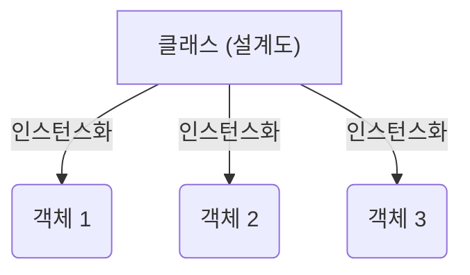

# Method and Class in Java (2025/06/30)

## 🏛️ 클래스 (Class)

Java에서 **클래스**는 객체를 생성하기 위한 '설계도' 또는 '틀'입니다. 관련된 데이터(변수)와 그 데이터를 처리하는 동작(메서드)을 하나로 묶는 방법을 제공합니다. 즉, 특정 종류의 객체가 가져야 할 공통적인 속성과 기능을 정의합니다.

### 클래스 선언

`class` 키워드를 사용하여 클래스를 선언합니다.

```java
class 클래스명 {
    // 필드 (변수와 메서드)
}
```

  - **필드(Field)**: 클래스에 포함된 변수와 메서드를 의미합니다.

### 클래스 필드 사용: 인스턴스화 (Instantiation)

클래스의 필드를 사용하려면, 먼저 클래스로부터 \*\*객체(Object)\*\*를 만들어야 합니다. 이 과정을 \*\*인스턴스화(Instantiation)\*\*라고 합니다. 인스턴스화는 추상적인 설계도(클래스)를 메모리 상에 구체적인 실체(객체)로 만드는 작업입니다.

  - **문법**: `클래스명 객체명 = new 클래스명();`
  - 이 과정을 통해 클래스의 \*\*인스턴스(instance)\*\*가 생성되며, 이를 흔히 객체라고 부릅니다.

<!-- end list -->



-----

## 🏗️ 생성자 (Constructor)

**생성자**는 `new` 키워드로 객체를 생성할 때, 해당 객체를 초기화하기 위해 호출되는 특별한 메서드입니다.

  - 생성자의 이름은 **클래스의 이름과 반드시 동일**해야 합니다.
  - **리턴 타입이 존재하지 않습니다** (`void`도 사용하지 않음).
  - 주요 역할은 객체의 필드를 위한 메모리를 할당하고, 그 메모리의 주소값을 반환하는 것입니다.

| 특징 | 메서드 (Method) | 생성자 (Constructor) |
| :--- | :--- | :--- |
| **목적** | 특정 기능을 수행 | 객체를 초기화 |
| **이름** | 자유롭게 지정 가능 | 반드시 클래스 이름과 동일 |
| **리턴 타입** | 반드시 명시 (`void` 포함) | 리턴 타입 없음 |
| **호출** | 프로그래머가 명시적으로 호출 | 객체 생성 시 자동으로 호출 |

### 기본 생성자 (Default Constructor)

클래스에 생성자를 하나도 정의하지 않으면, 자바 컴파일러가 자동으로 **기본 생성자**를 추가해 줍니다.

  - **매개변수가 없는** 생성자입니다.
  - 내용은 비어 있습니다.
  - 만약 프로그래머가 어떤 종류의 생성자든 **직접 하나라도 선언하면**, 기본 생성자는 자동으로 만들어지지 않습니다.

### `this` 키워드

메서드나 생성자 내부에서 `this`는 \*\*현재 객체(자기 자신)\*\*를 가리키는 참조 변수입니다. 주로 인스턴스 변수와 매개변수의 이름이 같을 때 둘을 구분하기 위해 사용됩니다.

  - 객체가 생성될 때, 해당 객체가 할당된 메모리의 주소값이 `this`라는 변수에 자동으로 담깁니다. 이를 통해 객체는 자기 자신의 필드에 접근할 수 있습니다.

### 예제: `Company` 클래스

```java
package classTest;

// 추상화: 불필요한 부분은 제외하고 핵심적인 특징만 표현
public class Company {
    String name;
    int age;
    int income;

    // 기본 생성자
    public Company() {;}

    // 초기화 생성자
    public Company(String name, int age) {
        // 'this.name'은 인스턴스 변수 'name'을 의미
        // 오른쪽에 있는 'name'은 매개변수 'name'을 의미
        this.name = name;
        this.age = age;
    }

    public static void main(String[] args) {
        // Company 클래스의 객체(인스턴스) 생성
        Company employee1 = new Company("홍길동", 20);
        System.out.println(employee1.name); // 출력: 홍길동

        Company employee2 = new Company("김길동", 45);
        System.out.println(employee2.name); // 출력: 김길동

        Company employee3 = new Company("장독대", 15);
        System.out.println(employee3.name); // 출력: 장독대
    }
}
```

-----

## 🛠️ 메서드 (Method)

**메서드**는 객체의 동작(기능)을 정의하는 코드 블록입니다. 특정 작업을 수행하며, 필요할 때마다 호출하여 사용할 수 있습니다.

### 메서드 선언 및 사용

```java
// 선언부
리턴타입 메서드명(매개변수1, 매개변수2, ...) {
    // 메서드 본문 (구현부)
    return 값; // 리턴타입이 void가 아닐 경우
}
```

메서드를 사용하려면 먼저 해당 메서드가 포함된 클래스의 인스턴스를 생성해야 합니다.

```java
// MethodTest.java
package methodTest;

public class MethodTest {

    // 리턴값이 없는(void) 메서드
    void printTest(String name) {
        System.out.println(name);
    }

    // 정수(int)를 리턴하는 메서드
    int sumTest(int num1, int num2) {
        return num1 + num2;
    }

    public static void main(String[] args) {
        // 1. 객체 생성 (동적 메모리 할당)
        MethodTest mt = new MethodTest();

        // 2. 메서드 호출(사용)
        mt.printTest("홍길동"); // 출력: 홍길동

        int result = mt.sumTest(20, 30);
        System.out.println(result); // 출력: 50
    }
}
```

### 메서드에서의 참조와 값

메서드에 변수를 전달할 때, 자바는 변수의 타입에 따라 다르게 동작합니다.

  - **기본형 타입 (Primitive Types: int, double 등)**: 변수의 **값**이 복사되어 전달됩니다 (**Call by Value**, 값에 의한 호출). 메서드 안에서 값을 변경해도 원본 변수에는 영향이 없습니다.
  - **참조형 타입 (Reference Types: 배열, 객체 등)**: 변수가 가리키는 객체의 **주소값**이 복사되어 전달됩니다 (**Call by Reference**, 참조에 의한 호출). 메서드 안에서 객체의 내용을 변경하면 원본 객체도 **변경됩니다**.

#### 예제: `LocationTest`

```java
// LocationTest.java
package methodTest;

public class LocationTest {

    // 이 메서드는 배열의 주소값을 받습니다.
    int[] test(int[] data) {
        // 전달받은 주소에 있는 배열의 값을 직접 수정
        data[0] = 20;
        return data;
    }

    public static void main(String[] args) {
        LocationTest lt = new LocationTest();
        int[] data = {50};

        System.out.println("test() 호출 전: " + data[0]); // 출력: 50
        lt.test(data); // 'data' 배열의 주소값을 메서드에 전달
        System.out.println("test() 호출 후: " + data[0]);  // 출력: 20
    }
}
```

이 예제에서 `test` 메서드는 원본 `data` 배열의 주소값을 받았기 때문에, 메서드 내부의 수정이 원본 배열에 직접 반영됩니다.

### 가변 인자 (Varargs)

가변 인자를 사용하면, 메서드가 정해지지 않은 개수의 인자를 받을 수 있습니다.

  - **문법**: `리턴타입 메서드명(타입... 변수명)`
  - 메서드 내부에서 가변 인자는 배열처럼 취급됩니다.

#### 예제: 최댓값 찾기

```java
// MethodTask2.java (일부)
int getMax2(int... numbers) {
    int max = numbers[0];
    for (int i = 1; i < numbers.length; i++) {
        if (max < numbers[i]) {
            max = numbers[i];
        }
    }
    return max;
}

// 사용 예시
// getMax2(10, 20, 30, 40, 50); // 50을 반환
```

### 메서드 예제 및 과제

다음은 실제적인 메서드 활용 예제입니다.

#### 과제 1: 기본 연산

```java
// MethodTask1.java
public class MethodTask1 {

    // 1. 정수를 하나 전달받아 2배로 값을 반환하는 메서드
    int multipleBy2(int num) {
        return num * 2;
    }

    // 2. 이름을 n번 출력하는 메서드
    void printName(String name, int count) {
        for (int i = 0; i < count; i++) {
            System.out.println(name);
        }
    }
}
```

#### 과제 2: 배열과 가변 인자

```java
// MethodTask2.java
public class MethodTask2 {

    // 1. 두 수의 대소비교 후 큰 값을 알려주는 메서드
    int getMax(int num1, int num2) {
        if (num1 == num2) { return -1; } // 같을 경우 -1 반환 (또는 예외 처리)
        return num1 > num2 ? num1 : num2;
    }

    // 2. 정수 배열을 받아 평균값을 구하는 메서드
    double getAverage(int[] arr) {
        int total = 0;
        for (int i = 0; i < arr.length; i++) {
            total += arr[i];
        }
        return (double)total / arr.length; // 정확한 소수점 계산을 위해 double로 형변환
    }

    // 3. 가변 인자를 사용하여 0과 1의 개수를 세는 메서드
    String getCountZeroAndOne(int... numbers) {
        int zeroCount = 0;
        int oneCount = 0;
        for (int num : numbers) {
            if (num == 0) {
                zeroCount++;
            } else if (num == 1) {
                oneCount++;
            }
        }
        return "결과)\n0의 개수: " + zeroCount + "\n1의 개수: " + oneCount;
    }
}
```

#### 과제 3: 문자열 조작

```java
// MethodTask3.java
public class MethodTask3 {

    // 1. "가a나a다a라a마a바" 값 중에서 'a'를 제거하고 "가나다라마바"만 출력
    // charAt(인덱스)를 사용하여 특정 위치의 문자를 가져옴
    void removeA(String content) {
        String result = "";
        for (int i = 0; i < content.length(); i++) {
            if (content.charAt(i) != 'a') {
                result += content.charAt(i);
            }
        }
        System.out.println(result); // 출력: 가나다라마바
    }

    // 2. "abcdefg"를 전달하면 "gfedcba"로 뒤집어서 반환하는 메서드
    String reverse(String content) {
        String result = "";
        // 문자열의 마지막 인덱스부터 0까지 감소
        for (int i = content.length() - 1; i >= 0; i--) {
            result += content.charAt(i);
        }
        return result; // "abcdefg"를 받으면 "gfedcba"를 반환
    }
}
```

#### 유용한 문자열 메서드

  - `str.split(구분자)`: 문자열을 `구분자` 기준으로 잘라서 문자열 배열로 반환합니다.
      - `"가.나.다".split("\\.")` -\> `{"가", "나", "다"}` (`.`은 정규식에서 특별한 의미를 가지므로 `\\`로 이스케이프 처리해야 합니다.)
  - `str.indexOf(문자)`: 특정 문자가 처음 나타나는 위치의 인덱스를 반환합니다.
  - `str.charAt(인덱스)`: 특정 인덱스에 있는 문자(char)를 반환합니다.
