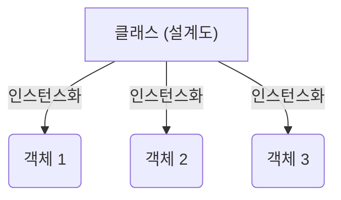

# Java의 메소드와 클래스 (2025/06/30)

## 🏛️ 클래스 (Class)

Java에서 **클래스**는 객체(object)를 생성하기 위한 설계도입니다. 데이터(변수)와 그 데이터에 대해 작동하는 메소드(함수)를 하나의 단위로 묶는 방법입니다. 특정 타입의 객체가 가져야 할 공통적인 속성과 행동을 정의하는 템플릿이라고 생각할 수 있습니다.

### 클래스 선언

`class` 키워드를 사용하여 클래스를 선언합니다.

```java
class 클래스이름 {
    // 필드 (변수와 메소드)
}
```

  - **필드(Fields)**: 클래스에 속한 변수와 메소드를 의미합니다.

### 클래스 필드 사용하기: 인스턴스화

클래스의 필드를 사용하려면 먼저 클래스로부터 \*\*객체(object)\*\*를 생성해야 합니다. 이 과정을 \*\*인스턴스화(instantiation)\*\*라고 합니다. 인스턴스화는 추상적인 설계도(클래스)를 메모리 상의 구체적인 실체(객체)로 만드는 과정입니다.

  - **문법**: `클래스이름 객체이름 = new 클래스이름();`
  - 이 코드는 클래스의 \*\*인스턴스(instance)\*\*를 생성하며, 이를 **인스턴스 변수** 또는 **객체**라고도 부릅니다.

<!-- end list -->



-----

## 🏗️ 생성자 (Constructor)

**생성자**는 새로 생성된 객체를 초기화하는 데 사용되는 특별한 메소드입니다. `new` 키워드를 사용할 때 자동으로 호출됩니다.

  - 클래스와 **동일한 이름**을 가집니다.
  - `void`를 포함하여 **어떠한 반환 타입도 가지지 않습니다**.
  - 주된 역할은 객체의 필드를 위한 메모리를 할당하고 그 메모리 주소를 반환하는 것입니다.

| 특징 | 메소드 | 생성자 |
| :--- | :--- | :--- |
| **목적** | 특정 연산을 수행하기 위함 | 객체를 초기화하기 위함 |
| **이름** | 모든 유효한 식별자 가능 | 반드시 클래스 이름과 동일해야 함 |
| **반환 타입** | 반드시 반환 타입(또는 `void`)이 있어야 함 | 반환 타입이 없음 |
| **호출** | 프로그래머가 명시적으로 호출 | 객체 생성 시 암시적으로 호출 |

### 기본 생성자 (Default Constructor)

만약 클래스에 어떠한 생성자도 정의하지 않으면, 자바 컴파일러가 자동으로 **기본 생성자**를 제공합니다.

  - **매개변수(parameter)가 없습니다**.
  - 본문(body)은 비어 있습니다.
  - 만약 사용자가 다른 생성자를 하나라도 정의하면, 기본 생성자는 자동으로 생성되지 **않습니다**.

### `this` 키워드

메소드나 생성자 내부에서 `this`는 **현재 객체**를 가리키는 참조 변수입니다. 즉, 현재 호출된 메소드나 생성자가 속한 객체를 의미합니다. 인스턴스 변수와 지역 변수의 이름이 같을 때 둘을 구분하기 위해 사용됩니다.

  - 객체가 생성될 때, 해당 객체의 메모리 주소는 자동으로 `this` 변수에 저장됩니다. 이를 통해 객체는 자신이 어떤 특정 인스턴스의 필드에 접근해야 하는지 알 수 있습니다.

### 예제: `Company` 클래스

```java
package classTest;

// 추상화: 배경의 세부 사항을 포함하지 않고 필수적인 특징만 표현하는 것
public class Company {
    String name;
    int age;
    int income;

    // 기본 생성자
    public Company() {;}

    // 초기화 생성자
    public Company(String name, int age) {
        // 'this.name'은 인스턴스 변수 'name'을 가리킴
        // 'name'은 매개변수 'name'을 가리킴
        this.name = name;
        this.age = age;
    }

    public static void main(String[] args) {
        // Company 클래스의 객체(인스턴스) 생성
        Company employee1 = new Company("홍길동", 20);
        System.out.println(employee1.name); // 출력: 홍길동

        Company employee2 = new Company("김길동", 45);
        System.out.println(employee2.name); // 출력: 김길동

        Company employee3 = new Company("장독대", 15);
        System.out.println(employee3.name); // 출력: 장독대
    }
}
```

-----

## 🛠️ 메소드 (Method)

**메소드**는 객체의 행동을 정의합니다. 호출될 때 실행되는 코드 블록입니다.

### 메소드 선언 및 사용

```java
// 선언
반환타입 메소드이름(매개변수1, 매개변수2, ...) {
    // 메소드 본문
    return 값; // 반환타입이 void가 아닐 경우
}
```

메소드를 사용하려면, 먼저 해당 클래스의 인스턴스를 생성해야 합니다.

```java
// MethodTest.java
package methodTest;

public class MethodTest {

    // 값을 반환하지 않는(void) 메소드
    void printTest(String name) {
        System.out.println(name);
    }

    // 정수를 반환하는 메소드
    int sumTest(int num1, int num2) {
        return num1 + num2;
    }

    public static void main(String[] args) {
        // 1. 객체 생성
        MethodTest mt = new MethodTest();

        // 2. 메소드 호출
        mt.printTest("홍길동"); // 출력: 홍길동

        int result = mt.sumTest(20, 30);
        System.out.println(result); // 출력: 50
    }
}
```

### 메소드에서의 참조와 값

변수를 메소드에 전달할 때, Java의 동작은 변수의 타입에 따라 달라집니다.

  - **기본 타입 (int, double 등)**: 값의 복사본이 전달됩니다 (**값에 의한 전달, Pass by Value**). 메소드 내부에서의 변경이 원래 변수에 영향을 주지 않습니다.
  - **참조 타입 (배열, 객체)**: 메모리 주소의 복사본이 전달됩니다 (**참조에 의한 전달, Pass by Reference**). 메소드 내부에서 객체의 필드를 변경하면 원래 객체에도 **영향을 미칩니다**.

#### 예제: `LocationTest`

```java
// LocationTest.java
package methodTest;

public class LocationTest {

    // 이 메소드는 배열에 대한 참조를 받습니다.
    int[] test(int[] data) {
        // 주어진 메모리 주소에 있는 배열을 수정합니다.
        data[0] = 20;
        return data;
    }

    public static void main(String[] args) {
        LocationTest lt = new LocationTest();
        int[] data = {50};

        System.out.println("test() 호출 전: " + data[0]); // 출력: 50
        lt.test(data); // 'data'의 참조를 메소드에 전달합니다.
        System.out.println("test() 호출 후: " + data[0]);  // 출력: 20
    }
}
```

이 예제에서 `test` 메소드는 `data` 배열의 메모리 주소를 받기 때문에 원본 배열을 수정합니다.

### 가변 인자 (Varargs)

가변 인자를 사용하면 메소드가 특정 타입의 인자를 0개 이상 받을 수 있습니다. 이는 메소드에 몇 개의 인자가 전달될지 모를 때 유용합니다.

  - **문법**: `반환타입 메소드이름(자료형... 변수이름)`
  - 메소드 내부에서 가변 인자는 배열로 처리됩니다.

#### 예제: 최댓값 찾기

```java
// MethodTask2.java (일부)
int getMax2(int... numbers) {
    int max = numbers[0];
    for (int i = 1; i < numbers.length; i++) {
        if (max < numbers[i]) {
            max = numbers[i];
        }
    }
    return max;
}

// 사용 예시
// getMax2(10, 20, 30, 40, 50); -> 50을 반환
```

### 메소드 예제 및 과제

다음은 실제적인 메소드 예제들입니다.

#### 과제 1: 기본 연산

```java
// MethodTask1.java
public class MethodTask1 {

    // 1. 정수 값의 두 배를 반환
    int multipleBy2(int num) {
        return num * 2;
    }

    // 2. 이름을 n번 출력
    void printName(String name, int count) {
        for (int i = 0; i < count; i++) {
            System.out.println(name);
        }
    }
}
```

#### 과제 2: 배열과 가변 인자

```java
// MethodTask2.java
public class MethodTask2 {

    // 1. 두 수 중 더 큰 수를 반환
    int getMax(int num1, int num2) {
        if (num1 == num2) { return -1; } // 또는 오류로 처리
        return num1 > num2 ? num1 : num2;
    }

    // 2. 정수 배열의 평균을 계산
    double getAverage(int[] arr) {
        int total = 0;
        for (int i = 0; i < arr.length; i++) {
            total += arr[i];
        }
        // 정확한 나눗셈을 위해 double로 형변환
        return (double)total / arr.length;
    }

    // 3. 가변 인자를 사용하여 0과 1의 개수 세기
    String getCountZeroAndOne(int... numbers) {
        int zeroCount = 0;
        int oneCount = 0;
        for (int num : numbers) {
            if (num == 0) {
                zeroCount++;
            } else if (num == 1) {
                oneCount++;
            }
        }
        return "결과)\n0의 개수: " + zeroCount + "\n1의 개수: " + oneCount;
    }
}
```

#### 과제 3: 문자열 조작

```java
// MethodTask3.java
public class MethodTask3 {

    // 1. 문자열에서 모든 'a' 문자 제거
    // charAt(index)를 사용하여 특정 위치의 문자를 가져옵니다.
    void removeA(String content) {
        String result = "";
        for (int i = 0; i < content.length(); i++) {
            if (content.charAt(i) != 'a') {
                result += content.charAt(i);
            }
        }
        System.out.println(result); // 입력이 "가a나a다a라a마a바a"일 경우 출력: 가나다라마바
    }

    // 2. 문자열 뒤집기
    String reverse(String content) {
        String result = "";
        for (int i = content.length() - 1; i >= 0; i--) {
            result += content.charAt(i);
        }
        return result; // "abcdefg"에 대해 "gfedcba"를 반환
    }
}
```

#### 유용한 문자열 메소드

  - `str.split(delimiter)`: 구분자(delimiter)를 기준으로 문자열을 분할하여 하위 문자열의 배열로 만듭니다.
      - `"a.b.c".split("\\.")` -\> `{"a", "b", "c"}` (점(.)은 정규식에서 특수 문자이므로 `\\`로 이스케이프해야 합니다.)
  - `str.indexOf(char)`: 특정 문자가 처음 나타나는 위치의 인덱스를 반환합니다.
  - `str.charAt(index)`: 특정 인덱스에 있는 문자를 반환합니다.