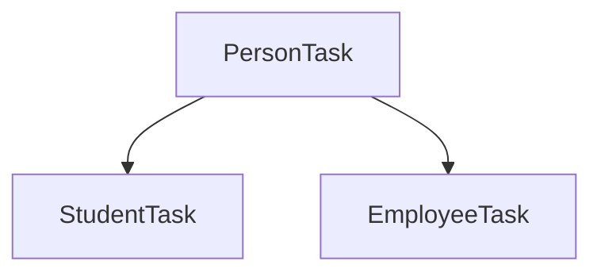

# Java Inheritance & Polymorphism (2025-07-02)

## 📜 Inheritance (상속)

**Inheritance** is a fundamental mechanism in Object-Oriented Programming (OOP) where a new class derives properties (fields) and behaviors (methods) from an existing class. This promotes code reusability and establishes a clear relationship between classes.

  - **Purpose**: To reuse fields and methods of an existing class in a new class. When multiple classes share common fields, you can create a parent class (an abstraction) that groups these common fields and then have child classes inherit from it.
  - **Parent Class (Superclass)**: The class whose properties are inherited. Also known as a superclass or base class.
  - **Child Class (Subclass)**: The class that inherits the properties. Also known as a subclass, derived class, or extended class.

### Syntax

The `extends` keyword is used for inheritance in Java.

```java
// Parent Class (Superclass)
class A {
    // Fields and methods of A
}

// Child Class (Subclass)
// Class B inherits all public and protected members of A
class B extends A {
    // It has access to fields of A
    // and can also have its own specific fields and methods.
}
```

### The `super` Keyword

In a child class, the `super` keyword is used to refer to its immediate parent class.

  - `super()`: Calls the parent class's constructor. It must be the very first statement in the child class's constructor.
  - `super.memberName`: Accesses a field or method of the parent class.

### Class Loading and Constructors

When a child class object is created, the parent class constructor is called *first*, before the child class constructor. This ensures that the inherited parts of the object are initialized before the child-specific parts.

```java
// inheritanceTest/InheritanceTest.java

class A {
	public A() {
		// This constructor is called first.
		System.out.println("Parent constructor called.");
	}
}

class B extends A {
	public B() {
		super(); // This call happens implicitly if not written.
		// This constructor is called second.
		System.out.println("Child constructor called.");
	}
}

public class InheritanceTest {
	public static void main(String[] args) {
		B b = new B();
	}
}
```

**Output:**

```
Parent constructor called.
Child constructor called.
```

-----

## 🎭 Polymorphism (다형성)

**Polymorphism**, meaning "many forms," allows objects to be treated as instances of their parent class, but still execute the overridden methods of their own class. This is achieved in two ways in Java: **Overloading** and **Overriding**.

### 1\. Overloading (Compile-Time Polymorphism)

**Overloading** allows a class to have multiple methods with the **same name**, as long as their **parameter lists are different**. The difference can be in the number of parameters or the type of parameters.

```java
class Calculator {
    // Method to add two integers
    int add(int a, int b) {
        return a + b;
    }

    // Overloaded method to add three integers
    int add(int a, int b, int c) {
        return a + b + c;
    }

    // Overloaded method to add two doubles
    double add(double a, double b) {
        return a + b;
    }
}
```

### 2\. Overriding (Runtime Polymorphism)

**Overriding** occurs when a child class provides a specific implementation for a method that is already defined in its parent class. The method in the child class must have the same name, return type, and parameters as the one in the parent class.

  - The `@Override` annotation is used to indicate that a method is intended to override a method in a superclass. It helps the compiler catch errors, for example, if the method signature doesn't match the parent's.
  - When a method is called on an object, the JVM decides at runtime which version of the method to execute based on the object's actual type. The parent's method in memory is effectively replaced by the child's implementation for objects of the child type.

### Example: `Person`, `Student`, and `Employee`

Let's look at an example where `Student` and `Employee` are specialized types of a `Person`.

#### Class Hierarchy Diagram



#### Base Class: `PersonTask`

This class defines the general attributes and behaviors of a person.

```java
// inheritanceTask/PersonTask.java
public class PersonTask {
    String name;
    int age;
    String address;
    String phone;

    // Constructor...
    public PersonTask(String name, int age, String address, String phone) {
        this.name = name;
        this.age = age;
        this.address = address;
        this.phone = phone;
    }

    public void work() { System.out.println("Works."); }
    public void sleep() { System.out.println("Sleeps."); }
    public void eat() { System.out.println("Eats three meals a day."); }
}
```

#### Subclasses: `StudentTask` and `EmployeeTask`

These classes inherit from `PersonTask` and **override** its methods to provide specialized behaviors.

\<br\>

**StudentTask.java**

```java
// inheritanceTask/StudentTask.java
public class StudentTask extends PersonTask {
    String instaId;

    public StudentTask(String name, int age, String address, String phone, String instaId) {
        super(name, age, address, phone); // Calls parent constructor
        this.instaId = instaId;
    }

    @Override
    public void work() { System.out.println("Does part-time work."); }
    @Override
    public void sleep() { System.out.println("Sleeps during class."); }
    @Override
    public void eat() { System.out.println("Skips breakfast."); }
}
```

**EmployeeTask.java**

```java
// inheritanceTask/EmployeeTask.java
public class EmployeeTask extends PersonTask {
    int emergencyCash;

    public EmployeeTask(String name, int age, String address, String phone, int cash) {
        super(name, age, address, phone); // Calls parent constructor
        this.emergencyCash = cash;
    }

    @Override
    public void work() { System.out.println("Works all day."); }
    @Override
    public void sleep() { System.out.println("Has a restless sleep."); }
    @Override
    public void eat() { System.out.println("Eats late-night snacks."); }
}
```

#### Method Behavior Summary

| Class         | `work()`                | `sleep()`                 | `eat()`                      |
|---------------|-------------------------|---------------------------|------------------------------|
| `PersonTask`  | Works.                  | Sleeps.                   | Eats three meals a day.      |
| `StudentTask` | Does part-time work.    | Sleeps during class.      | Skips breakfast.             |
| `EmployeeTask`| Works all day.          | Has a restless sleep.     | Eats late-night snacks.      |

-----

## 🌀 The `static` Keyword

The `static` keyword indicates that a member (field or method) belongs to the **class itself**, rather than to an instance (object) of the class.

### Key Characteristics of `static` Members

1.  **Single Copy**: There is only one copy of a static variable per class, regardless of how many objects are created. All objects of the class share this single variable.
2.  **Class-Level Access**: They can be accessed directly using the class name, e.g., `ClassName.staticMember`, without needing to create an object.
3.  **Early Initialization**: Static members are initialized when the class is loaded by the Java Virtual Machine (JVM), which happens before any objects of the class are created.
4.  **No `this`**: Static methods cannot use the `this` keyword because they are not associated with a specific object instance. They also cannot directly access instance variables or instance methods.

### When to Use `static`?

Use the `static` keyword when a variable's value needs to be shared among all objects of a class, like a counter or a constant value.

### Example: Instance vs. Static Variables

In the `StaticTest` example, `data` is an **instance variable** (dynamic), while `data_s` is a **static variable**.

```java
// staticTest/StaticTest.java
class Data {
    int data = 0;           // Instance variable, each object gets its own copy.
    static int data_s = 0;  // Static variable, shared by all objects.

    void increase() {
        System.out.println("Instance: " + ++data);
    }

    void increase_s() {
        System.out.println("Static: " + ++data_s);
    }
}

public class StaticTest {
    public static void main(String[] args) {
        System.out.println("--- First Object ---");
        Data data1 = new Data();
        data1.increase();   // Instance: 1
        data1.increase_s(); // Static: 1
        data1.increase_s(); // Static: 2

        System.out.println("\n--- Second Object ---");
        Data data2 = new Data();
        data2.increase();   // Instance: 1 (data2's own copy)
        data2.increase_s(); // Static: 3 (shared copy is incremented)
        data2.increase_s(); // Static: 4
    }
}
```

**Execution Analysis:**

  - `data1.increase()` increments its personal copy of `data`.
  - `data2.increase()` increments *its own* personal copy of `data`, which is separate from `data1`'s.
  - However, both `data1.increase_s()` and `data2.increase_s()` increment the *same* static variable `data_s`. The changes made by one object are visible to the other.
  - Creating a new object (`new Data()`) resets instance variables for the new object but has no effect on static variables. Static variables persist for the lifetime of the program unless the class is unloaded.