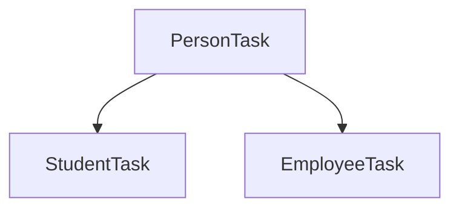

네, 알겠습니다. 학생의 노트를 바탕으로 작성한 한국어 버전입니다.

# Java OOP 노트: 상속과 다형성

**날짜:** 2025-07-02

-----

## 📜 상속 (Inheritance)

**상속**은 객체 지향 프로그래밍(OOP)의 핵심 개념으로, 새로운 클래스가 기존 클래스의 속성(필드)과 행동(메서드)을 물려받는 기능입니다. 이를 통해 코드 재사용성을 높이고 클래스 간의 관계를 명확하게 설정할 수 있습니다.

  - **목적**: 기존 클래스의 필드와 메서드를 새로운 클래스에서 재사용하기 위함입니다. 여러 클래스가 공통된 필드를 가질 때, 이 공통점을 묶어 부모 클래스(추상화)로 만들고, 자식 클래스들이 이를 상속받아 사용합니다.
  - **부모 클래스 (Superclass)**: 자신의 속성을 물려주는 클래스입니다. 슈퍼 클래스, 기반 클래스라고도 합니다.
  - **자식 클래스 (Subclass)**: 속성을 물려받는 클래스입니다. 서브 클래스, 파생 클래스라고도 합니다.

### 문법

Java에서는 `extends` 키워드를 사용하여 상속을 구현합니다.

```java
// 부모 클래스 (Superclass)
class A {
    // A의 필드와 메서드
}

// 자식 클래스 (Subclass)
// B 클래스는 A 클래스의 모든 public, protected 멤버를 상속받습니다.
class B extends A {
    // A의 필드를 사용할 수 있으며,
    // 자신만의 고유한 필드와 메서드를 추가할 수 있습니다.
}
```

### `super` 키워드

자식 클래스에서 `super` 키워드는 바로 위의 부모 클래스를 지칭할 때 사용됩니다.

  - `super()`: 부모 클래스의 생성자를 호출합니다. 자식 클래스 생성자의 가장 첫 줄에 위치해야 합니다.
  - `super.멤버이름`: 부모 클래스의 필드나 메서드에 접근할 때 사용합니다.

### 클래스 로딩과 생성자

자식 클래스의 객체가 생성될 때, **부모 클래스의 생성자가 먼저 호출**되고 그 후에 자식 클래스의 생성자가 호출됩니다. 이는 상속받은 멤버들이 자식 클래스의 멤버들보다 먼저 초기화되도록 보장합니다.

```java
// inheritanceTest/InheritanceTest.java

class A {
	public A() {
		// 이 생성자가 먼저 호출됩니다.
		System.out.println("부모 생성자 호출");
	}
}

class B extends A {
	public B() {
		super(); // 이 코드는 작성하지 않아도 자동으로 호출됩니다.
		// 이 생성자가 두 번째로 호출됩니다.
		System.out.println("자식 생성자 호출");
	}
}

public class InheritanceTest {
	public static void main(String[] args) {
		B b = new B();
	}
}
```

**출력 결과:**

```
부모 생성자 호출
자식 생성자 호출
```

-----

## 🎭 다형성 (Polymorphism)

**다형성**은 "여러 형태를 가진다"는 의미로, 하나의 객체가 여러 타입의 객체로 취급될 수 있는 능력을 말합니다. 이를 통해 코드의 유연성과 확장성을 높일 수 있습니다. Java에서는 **오버로딩**과 **오버라이딩**을 통해 다형성을 구현합니다.

### 1\. 오버로딩 (Overloading - 컴파일 타임 다형성)

**오버로딩**은 하나의 클래스 내에서 **같은 이름**의 메서드를 여러 개 정의하는 것을 허용하는 기능입니다. 단, 메서드의 **매개변수 목록(개수 또는 타입)이 달라야 합니다.**

```java
class Calculator {
    // 두 정수를 더하는 메서드
    int add(int a, int b) {
        return a + b;
    }

    // 세 정수를 더하는 오버로딩된 메서드
    int add(int a, int b, int c) {
        return a + b + c;
    }

    // 두 실수를 더하는 오버로딩된 메서드
    double add(double a, double b) {
        return a + b;
    }
}
```

### 2\. 오버라이딩 (Overriding - 런타임 다형성)

**오버라이딩**은 자식 클래스가 부모 클래스로부터 상속받은 메서드를 자신에게 맞게 **재정의**하는 것을 의미합니다. 자식 클래스의 메서드는 부모 클래스의 메서드와 이름, 리턴 타입, 매개변수 목록이 반드시 동일해야 합니다.

  - `@Override` 어노테이션은 해당 메서드가 부모 클래스의 메서드를 재정의한다는 것을 명시적으로 나타냅니다. 이를 통해 컴파일러가 시그니처 불일치 등의 실수를 잡아낼 수 있도록 도와줍니다.
  - 객체의 메서드가 호출될 때, JVM은 런타임(실행 시점)에 해당 객체의 실제 타입을 기준으로 어떤 버전의 메서드(부모 또는 자식)를 실행할지 결정합니다.

### 예제: `Person`, `Student`, `Employee`

`Student`와 `Employee`가 `Person`의 특정 유형일 때의 예제를 살펴봅시다.

#### 클래스 계층 구조도



#### 기반 클래스: `PersonTask`

사람의 일반적인 속성과 행동을 정의합니다.

```java
// inheritanceTask/PersonTask.java
public class PersonTask {
    String name;
    int age;
    String address;
    String phone;

    // 생성자...
    public PersonTask(String name, int age, String address, String phone) {
        this.name = name;
        this.age = age;
        this.address = address;
        this.phone = phone;
    }

    public void work() { System.out.println("일을 한다."); }
    public void sleep() { System.out.println("잠을 잔다."); }
    public void eat() { System.out.println("세 끼를 먹는다."); }
}
```

#### 서브 클래스: `StudentTask`, `EmployeeTask`

`PersonTask`를 상속받아, 자신들만의 특화된 행동을 위해 메서드를 **오버라이딩**합니다.

\<br\>

**StudentTask.java**

```java
// inheritanceTask/StudentTask.java
public class StudentTask extends PersonTask {
    String instaId;

    public StudentTask(String name, int age, String address, String phone, String instaId) {
        super(name, age, address, phone); // 부모 생성자 호출
        this.instaId = instaId;
    }

    @Override
    public void work() { System.out.println("아르바이트를 한다."); }
    @Override
    public void sleep() { System.out.println("수업 시간에 잠을 잔다."); }
    @Override
    public void eat() { System.out.println("아침을 거른다."); }
}
```

**EmployeeTask.java**

```java
// inheritanceTask/EmployeeTask.java
public class EmployeeTask extends PersonTask {
    int cash; // 비상금

    public EmployeeTask(String name, int age, String address, String phone, int cash) {
        super(name, age, address, phone); // 부모 생성자 호출
        this.cash = cash;
    }

    @Override
    public void work() { System.out.println("하루 종일 일을 한다."); }
    @Override
    public void sleep() { System.out.println("잠을 설친다."); }
    @Override
    public void eat() { System.out.println("야식을 먹는다."); }
}
```

#### 메서드 행동 요약

| 클래스          | `work()`              | `sleep()`             | `eat()`             |
|---------------|-----------------------|-----------------------|---------------------|
| `PersonTask`  | 일을 한다.              | 잠을 잔다.              | 세 끼를 먹는다.       |
| `StudentTask` | 아르바이트를 한다.        | 수업 시간에 잠을 잔다.  | 아침을 거른다.        |
| `EmployeeTask`| 하루 종일 일을 한다.    | 잠을 설친다.            | 야식을 먹는다.        |

-----

## 🌀 `static` 키워드

`static` 키워드는 특정 멤버(필드 또는 메서드)가 객체(인스턴스)에 속하는 것이 아니라 **클래스 자체**에 속하도록 지정합니다.

### `static` 멤버의 주요 특징

1.  **단 하나의 복사본**: `static` 변수는 객체가 몇 개 생성되든 상관없이 클래스당 단 하나만 생성됩니다. 모든 객체는 이 변수를 공유합니다.
2.  **클래스 레벨 접근**: 객체를 생성하지 않고도 `클래스이름.정적멤버` 형식으로 직접 접근할 수 있습니다.
3.  **조기 초기화**: `static` 멤버는 JVM이 클래스를 로딩할 때 초기화됩니다. 이는 클래스의 어떤 객체보다도 먼저 생성됨을 의미합니다.
4.  **`this` 사용 불가**: `static` 메서드는 특정 객체 인스턴스와 연결되어 있지 않으므로 `this` 키워드를 사용할 수 없습니다. 또한, 인스턴스 변수나 인스턴스 메서드에 직접 접근할 수 없습니다.

### `static` 사용 시점

하나의 변수 값을 클래스의 모든 객체가 공유해야 할 때 사용합니다 (예: 전체 객체 수를 세는 카운터, 공용 상수 등).

### 예제: 인스턴스 변수 vs. `static` 변수

`StaticTest` 예제에서 `data`는 **인스턴스 변수**(동적)이고, `data_s`는 **`static` 변수**(정적)입니다.

```java
// staticTest/StaticTest.java
class Data {
    int data = 0;           // 인스턴스 변수. 각 객체는 자신만의 복사본을 가집니다.
    static int data_s = 0;  // static 변수. 모든 객체가 공유합니다.

    void increase() {
        System.out.println("인스턴스: " + ++data);
    }

    void increase_s() {
        System.out.println("Static: " + ++data_s);
    }
}

public class StaticTest {
    public static void main(String[] args) {
        System.out.println("--- 첫 번째 객체 ---");
        Data data1 = new Data();
        data1.increase();   // 인스턴스: 1
        data1.increase_s(); // Static: 1
        data1.increase_s(); // Static: 2

        System.out.println("\n--- 두 번째 객체 ---");
        Data data2 = new Data();
        data2.increase();   // 인스턴스: 1 (data2의 고유한 복사본)
        data2.increase_s(); // Static: 3 (공유되는 변수가 계속 증가)
        data2.increase_s(); // Static: 4
    }
}
```

**실행 분석:**

  - `data1.increase()`는 `data1` 객체 고유의 `data` 변수를 증가시킵니다.
  - `data2.increase()`는 `data1`의 `data`와는 별개인, `data2` 객체 고유의 `data` 변수를 증가시킵니다.
  - 하지만 `data1.increase_s()`와 `data2.increase_s()`는 모두 **동일한** `static` 변수 `data_s`를 증가시킵니다. 즉, 한 객체에 의해 변경된 값이 다른 객체에도 영향을 줍니다.
  - `new Data()`를 통해 새 객체를 생성하면 인스턴스 변수는 초기화되지만, `static` 변수는 프로그램이 종료될 때까지 그 값을 유지합니다.