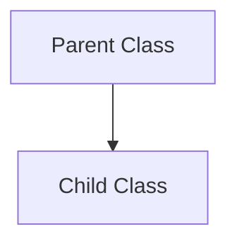

# Casting (2025/07/03)

## 1\. What is a Class in Java?

In Java, a class is a blueprint for creating objects. It's important to remember two key things:

  - **It's a Type**: A class defines a new data type. For instance, if you create a `Person` class, you can create variables of type `Person`.
  - **It's a Subject**: In terms of object-oriented programming, it's the entity that has properties (fields) and can perform actions (methods).

## 2\. What is Casting?

Casting is the process of converting an object of one type to another. In the context of inheritance, it's about changing an object's reference type within its own class hierarchy.

### The Hierarchy Diagram

Think of the relationship between a parent class (superclass) and a child class (subclass) like this:



  - **Upcasting**: Going from Child `B` to Parent `A`.
  - **Downcasting**: Going from Parent `A` back to Child `B`.

### Upcasting

This involves converting a child object to a parent type. It's an implicit conversion, meaning you don't have to write the cast explicitly (though you can). Upcasting is always safe because a child class is guaranteed to have everything the parent class has.

  - **Syntax**: `ParentType parentRef = new ChildType();`
  - **Purpose**: To write more general code. You can have a method that operates on the `ParentType`, and it will work with any of its `ChildType` objects.

### Downcasting

This is the process of converting an object that was **previously upcast** back to its original child type. This is an explicit conversion and requires a check using the `instanceof` operator to prevent runtime errors.

  - **Syntax**: `ChildType childRef = (ChildType) parentRef;`
  - **Warning**: You cannot simply cast a new parent object to a child type. This will cause a `ClassCastException` because the parent object is *not* an instance of the child class.

<!-- end list -->

```java
// This is NOT possible and will cause an error.
// The object created is a 'Person', not an 'Alien'.
// Alien b = (Alien) new Person(); // Throws ClassCastException at runtime
```

-----

## 3\. Example: `Car` and `SuperCar` 🚗

Let's explore casting with a more detailed example.

### The Classes

| Class | Methods |
| :--- | :--- |
| `Car` | `engineStart()` |
| `SuperCar` (extends `Car`) | `engineStart()` (Overridden)\<br\>`openRoof()` |

### Code Example

```java
// Parent Class
class Car {
    void engineStart() {
        System.out.println("Key turned, engine starting!");
    }
}

// Child Class
class SuperCar extends Car {
    @Override
    void engineStart() {
        System.out.println("Voice command received, engine starting!");
    }

    void openRoof() {
        System.out.println("Roof is opening!");
    }
}

public class CastingTest2 {
    public static void main(String[] args) {
        // 1. Standard object creation
        SuperCar ferrari = new SuperCar();

        // 2. Upcasting
        // The object is a SuperCar, but the reference `noOptionFerrari` is of type Car.
        Car noOptionFerrari = new SuperCar();

        // 3. Downcasting
        // We cast `noOptionFerrari` back to its true type, SuperCar.
        SuperCar optionFerrari = (SuperCar) noOptionFerrari;
    }
}
```

### What Can Each Object Do?

| Object Reference | Type | `engineStart()` | `openRoof()` | Explanation |
| :--- | :--- | :--- | :--- | :--- |
| `ferrari` | `SuperCar` | ✅ (Voice command) | ✅ | Has access to all methods from both `SuperCar` and `Car`. |
| `noOptionFerrari` | `Car` | ✅ (Voice command) | ❌ | **Upcast**: The reference type is `Car`, so it only "knows" about methods in the `Car` class. Even though the actual object is a `SuperCar` (which is why the overridden `engineStart()` is called), you cannot call `openRoof()` through this reference. |
| `optionFerrari` | `SuperCar` | ✅ (Voice command) | ✅ | **Downcast**: The reference is now `SuperCar`, so it regains access to all its specific methods like `openRoof()`. |

-----

## 4\. The `instanceof` Operator

To safely downcast, you must first check if the object is actually an instance of the target child type. The `instanceof` operator is perfect for this.

  - **Syntax**: `objectReference instanceof Type`
  - **Returns**: `true` if the object can be cast to that `Type`; `false` otherwise.

### `instanceof` Results

Using the objects from the `Car` example:

| Check | Result | Reason |
| :--- | :--- | :--- |
| `matiz instanceof Car` | `true` | `matiz` is a `Car` object. |
| `matiz instanceof SuperCar` | `false` | A `Car` is not a `SuperCar`. |
| `ferrari instanceof Car` | `true` | `ferrari` is a `SuperCar`, which is a subtype of `Car`. |
| `ferrari instanceof SuperCar`| `true` | `ferrari` is a `SuperCar` object. |
| `noOptionFerrari instanceof Car`| `true` | The object is a `SuperCar`, which is a subtype of `Car`. |
| `noOptionFerrari instanceof SuperCar`| `true` | The actual object is a `SuperCar`, even if the reference is `Car`. |

-----

## 5\. Practical Application: Netflix & Game Examples

Casting is essential for writing flexible code that can handle various subtypes of a parent class differently.

### Example 1: Netflix Video Player

Imagine a Netflix system where `Video` is the parent class, and `Animation`, `Movie`, and `Drama` are child classes, each with a unique feature.

```java
public class CastingTask1 {

    public void checkVideo(Video video) {
        // Use instanceof to check the object's true type before casting
        if (video instanceof Drama) {
            Drama drama = (Drama) video; // Safe downcast
            drama.goods();
        } else if (video instanceof Animation) {
            Animation animation = (Animation) video; // Safe downcast
            animation.subtitle();
        } else if (video instanceof Movie) {
            Movie movie = (Movie) video; // Safe downcast
            movie.shakeChair();
        }
    }

    public static void main(String[] args) {
      CastingTask1 ct = new CastingTask1();
      ct.checkVideo(new Drama());     // Output: 굿즈
      ct.checkVideo(new Animation()); // Output: 자막 지원
      ct.checkVideo(new Movie());     // Output: 4D
    }
}
```

### Example 2: Game Character Hunting Monsters

A `Character` can hunt any `Monster`, but the loot (`dropItem`) depends on the specific type of monster.

```java
// Parent class for all monsters
public class Monster {
    public void dropItem() {
        System.out.println("An item was dropped.");
    }
}

// Child classes with specific loot
public class Orc extends Monster {
    @Override
    public void dropItem() { System.out.println("You got Orc Leather."); }
}
public class Fairy extends Monster {
    @Override
    public void dropItem() { System.out.println("You got Fairy Wings."); }
}
public class Human extends Monster {
    @Override
    public void dropItem() { System.out.println("You got Armor."); }
}


public class Character {
    String name;

    // This single method can handle any type of Monster
    public void hunt(Monster monster) {
        System.out.println(this.name + " is hunting a monster!");
        // We don't even need to cast here if we just call the overridden method!
        // The correct version of dropItem() is called automatically (Polymorphism).
        monster.dropItem();
    }
}

public class GameTask {
    public static void main(String[] args) {
        Character player = new Character("HyunZzang");
        Monster[] monsters = { new Fairy(), new Orc(), new Human() };

        // Hunt a Fairy
        player.hunt(monsters[0]); // Output: You got Fairy Wings.

        // Hunt an Orc
        player.hunt(monsters[1]); // Output: You got Orc Leather.
    }
}
```

*Note*: The `hunt` method in the game example cleverly uses **polymorphism**. By calling `monster.dropItem()`, Java automatically executes the overridden version of the method from the actual object's class (`Orc`, `Fairy`, etc.), often removing the need for an explicit `if-else` block with `instanceof` and casting. However, if the child classes had unique methods not in the `Monster` parent class, `instanceof` and downcasting would be necessary, just like in the Netflix example.