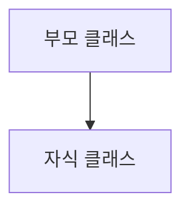

물론이죠. 방금 작성한 노트를 한국어 버전으로도 만들어 드릴게요.

-----

# ⭐ Java 노트: 캐스팅 (Casting)

## 1\. 자바에서 클래스(Class)란?

자바에서 클래스는 객체를 만들기 위한 '설계도'입니다. 두 가지 핵심 개념을 기억하는 것이 중요합니다.

  - **타입(Type)이다**: 클래스는 새로운 데이터 타입을 정의합니다. 예를 들어 `Person` 클래스를 만들면, `Person` 타입의 변수를 선언할 수 있습니다.
  - **주어(Subject)이다**: 객체 지향 프로그래밍에서 클래스는 속성(필드)을 가지고 행위(메서드)를 수행할 수 있는 주체입니다.

## 2\. 캐스팅(Casting)이란?

캐스팅은 한 타입의 객체를 다른 타입으로 형 변환하는 과정입니다. 상속 관계에서는 객체의 참조 타입을 자신의 클래스 계층 내에서 변경하는 것을 의미합니다.

### 상속 계층도

부모 클래스(슈퍼클래스)와 자식 클래스(서브클래스)의 관계는 아래와 같이 생각할 수 있습니다.



  - **업캐스팅 (Upcasting)**: 자식 `B`에서 부모 `A`로 형 변환.
  - **다운캐스팅 (Downcasting)**: 부모 `A`에서 다시 자식 `B`로 형 변환.

### 업캐스팅 (Upcasting)

자식 객체를 부모 타입으로 형 변환하는 것입니다. 이는 묵시적 변환으로, 명시적으로 캐스팅 코드를 작성하지 않아도 자동으로 이루어집니다. 업캐스팅은 항상 안전한데, 자식 클래스는 부모 클래스의 모든 멤버를 가지고 있기 때문입니다.

  - **문법**: `부모타입 참조변수 = new 자식타입();`
  - **목적**: 보다 일반적인 코드를 작성하기 위함입니다. `부모타입`을 다루는 메서드를 만들어두면, 그 메서드는 모든 `자식타입`의 객체를 처리할 수 있습니다.

### 다운캐스팅 (Downcasting)

**이전에 업캐스팅되었던** 객체를 다시 원래의 자식 타입으로 형 변환하는 과정입니다. 이는 명시적 변환이므로, 런타임 에러(`ClassCastException`)를 방지하기 위해 `instanceof` 연산자로 타입을 확인하는 과정이 필요합니다.

  - **문법**: `자식타입 참조변수 = (자식타입) 부모타입참조변수;`
  - **주의**: 새로운 부모 객체를 자식 타입으로 바로 캐스팅할 수는 없습니다. 부모 객체는 자식 클래스의 인스턴스가 아니기 때문에 런타임에 `ClassCastException` 오류가 발생합니다.

<!-- end list -->

```java
// 아래 코드는 불가능하며 에러가 발생합니다.
// 생성된 객체는 'Person'일 뿐, 'Alien'이 아닙니다.
// Alien b = (Alien) new Person(); // 실행 시 ClassCastException 발생
```

-----

## 3\. 예제: `Car` 와 `SuperCar` 🚗

더 자세한 예제를 통해 캐스팅을 살펴보겠습니다.

### 클래스 구조

| 클래스 | 메서드 |
| :--- | :--- |
| `Car` | `engineStart()` |
| `SuperCar` (`Car`를 상속) | `engineStart()` (오버라이딩)\<br\>`openRoof()` |

### 코드 예제

```java
// 부모 클래스
class Car {
    void engineStart() {
        System.out.println("열쇠로 시동 킴!");
    }
}

// 자식 클래스
class SuperCar extends Car {
    @Override
    void engineStart() {
        System.out.println("음성으로 엔진 스타트!");
    }

    void openRoof() {
        System.out.println("뚜껑 오픈!");
    }
}

public class CastingTest2 {
    public static void main(String[] args) {
        // 1. 일반적인 객체 생성
        SuperCar ferrari = new SuperCar();

        // 2. 업캐스팅
        // 실제 객체는 SuperCar이지만, 참조변수 noOptionFerrari는 Car 타입입니다.
        Car noOptionFerrari = new SuperCar();

        // 3. 다운캐스팅
        // noOptionFerrari를 다시 본래 타입인 SuperCar로 형 변환합니다.
        SuperCar optionFerrari = (SuperCar) noOptionFerrari;
    }
}
```

### 각 객체는 무엇을 할 수 있을까?

| 객체 참조변수 | 타입 | `engineStart()` | `openRoof()` | 설명 |
| :--- | :--- | :--- | :--- | :--- |
| `ferrari` | `SuperCar` | ✅ (음성 명령) | ✅ | `SuperCar`와 `Car`의 모든 메서드에 접근 가능합니다. |
| `noOptionFerrari` | `Car` | ✅ (음성 명령) | ❌ | **업캐스팅 상태**: 참조 타입이 `Car`이므로 `Car` 클래스에 정의된 메서드만 "알고" 있습니다. 실제 객체는 `SuperCar`이므로 오버라이딩된 `engineStart()`가 호출되지만, 이 참조변수로는 `openRoof()`를 호출할 수 없습니다. |
| `optionFerrari` | `SuperCar` | ✅ (음성 명령) | ✅ | **다운캐스팅 상태**: 참조변수가 다시 `SuperCar`가 되어 `openRoof()`와 같은 자신만의 고유한 메서드에 다시 접근할 수 있게 됩니다. |

-----

## 4\. `instanceof` 연산자

안전하게 다운캐스팅을 하려면, 먼저 객체가 실제로 목표하는 자식 타입의 인스턴스인지 확인해야 합니다. `instanceof` 연산자는 이럴 때 사용합니다.

  - **문법**: `객체참조변수 instanceof 타입`
  - **반환값**: 객체가 해당 `타입`으로 형 변환 가능하면 `true`, 아니면 `false`를 반환합니다.

### `instanceof` 결과

`Car` 예제의 객체들을 사용한 결과입니다.

| 확인 | 결과 | 이유 |
| :--- | :--- | :--- |
| `matiz instanceof Car` | `true` | `matiz`는 `Car` 객체입니다. |
| `matiz instanceof SuperCar` | `false` | `Car`는 `SuperCar`가 아닙니다. |
| `ferrari instanceof Car` | `true` | `ferrari`는 `SuperCar`이고, `SuperCar`는 `Car`의 자식 타입입니다. |
| `ferrari instanceof SuperCar`| `true` | `ferrari`는 `SuperCar` 객체입니다. |
| `noOptionFerrari instanceof Car`| `true` | 실제 객체는 `SuperCar`이며, 이는 `Car`의 자식 타입입니다. |
| `noOptionFerrari instanceof SuperCar`| `true` | 참조변수는 `Car` 타입이지만, 실제 객체는 `SuperCar`입니다. |

-----

## 5\. 실용적인 예제: 넷플릭스와 게임

캐스팅은 부모 클래스의 여러 자식 클래스들을 유연하게 처리하는 코드를 작성할 때 필수적입니다.

### 예제 1: 넷플릭스 비디오 플레이어

`Video`를 부모 클래스로, `Animation`, `Movie`, `Drama`를 각각 고유 기능이 있는 자식 클래스로 하는 넷플릭스 시스템을 상상해 보세요.

```java
public class CastingTask1 {

    public void checkVideo(Video video) {
        // instanceof로 객체의 실제 타입을 확인한 후 캐스팅합니다.
        if (video instanceof Drama) {
            Drama drama = (Drama) video; // 안전한 다운캐스팅
            drama.goods();
        } else if (video instanceof Animation) {
            Animation animation = (Animation) video; // 안전한 다운캐스팅
            animation.subtitle();
        } else if (video instanceof Movie) {
            Movie movie = (Movie) video; // 안전한 다운캐스팅
            movie.shakeChair();
        }
    }

    public static void main(String[] args) {
      CastingTask1 ct = new CastingTask1();
      ct.checkVideo(new Drama());     // 출력: 굿즈
      ct.checkVideo(new Animation()); // 출력: 자막 지원
      ct.checkVideo(new Movie());     // 출력: 4D
    }
}
```

### 예제 2: 게임 캐릭터의 몬스터 사냥

`Character`는 어떤 `Monster`든 사냥할 수 있지만, 전리품(`dropItem`)은 몬스터의 종류에 따라 달라집니다.

```java
// 모든 몬스터의 부모 클래스
public class Monster {
    public void dropItem() {
        System.out.println("아이템을 떨어뜨렸습니다.");
    }
}

// 특정 전리품을 가진 자식 클래스들
public class Orc extends Monster {
    @Override
    public void dropItem() { System.out.println("가죽을 얻습니다."); }
}
public class Fairy extends Monster {
    @Override
    public void dropItem() { System.out.println("날개를 얻습니다."); }
}
public class Human extends Monster {
    @Override
    public void dropItem() { System.out.println("갑옷을 얻습니다."); }
}


public class Character {
    String name;

    // 이 메서드 하나로 모든 종류의 몬스터를 처리할 수 있습니다.
    public void hunt(Monster monster) {
        System.out.println(this.name + "가 몬스터를 사냥합니다!");
        // 오버라이딩된 메서드를 호출하기만 하면 캐스팅이 필요 없습니다!
        // 이것이 바로 '다형성(Polymorphism)'입니다.
        monster.dropItem();
    }
}

public class GameTask {
    public static void main(String[] args) {
        Character player = new Character("현우");
        Monster[] monsters = { new Fairy(), new Orc(), new Human() };

        // 요정 사냥
        player.hunt(monsters[0]); // 출력: 날개를 얻습니다.

        // 오크 사냥
        player.hunt(monsters[1]); // 출력: 가죽을 얻습니다.
    }
}
```

*참고*: 게임 예제의 `hunt` 메서드는 \*\*다형성(Polymorphism)\*\*을 영리하게 활용합니다. `monster.dropItem()`을 호출하면, 자바는 실제 객체(`Orc`, `Fairy` 등)의 클래스에서 오버라이딩된 버전의 메서드를 자동으로 실행합니다. 이 덕분에 `instanceof`와 캐스팅을 사용하는 `if-else` 블록이 필요 없어지는 경우가 많습니다. 하지만 만약 자식 클래스가 부모인 `Monster` 클래스에 없는 고유한 메서드를 가지고 있었다면, 넷플릭스 예제처럼 `instanceof`와 다운캐스팅이 필요했을 것입니다.